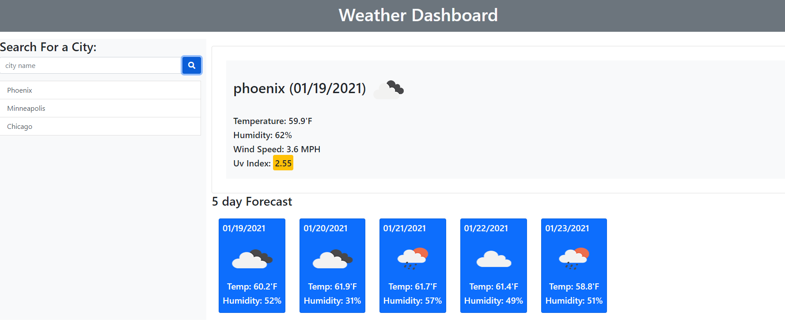

# Weather-Dashboard
Created a weather Dashboard that displays the current weather and weather forecast for next 5 days
using the open weather public Api. Have used local storage to get persistent data for the app.Built 
this application using Jquery, bootstrap and Moment.js libraries.
When the user types in the name of the city in the search city input field the app makes an ajax call to open Weather map and sends the response. It diplays the temperature, humidity, windSpeed and uv index for a particaular location. The uv index diplays with particular color background based on low,moderate and high values.


## User Story

```
AS A traveler
I WANT to see the weather outlook for multiple cities
SO THAT I can plan a trip accordingly
```
## Acceptance Criteria

```
GIVEN a weather dashboard with form inputs
WHEN I search for a city
THEN I am presented with current and future conditions for that city and that city is added to the search history
WHEN I view current weather conditions for that city
THEN I am presented with the city name, the date, an icon representation of weather conditions, the temperature, the humidity, the wind speed, and the UV index
WHEN I view the UV index
THEN I am presented with a color that indicates whether the conditions are favorable, moderate, or severe
WHEN I view future weather conditions for that city
THEN I am presented with a 5-day forecast that displays the date, an icon representation of weather conditions, the temperature, and the humidity
WHEN I click on a city in the search history
THEN I am again presented with current and future conditions for that city
WHEN I open the weather dashboard
THEN I am presented with the last searched city forecast
```
## Mockup
the following is the mockup image of this application


## Github Page
[weather-dashboard](https://selvivini.github.io/weather-dashboard/)
